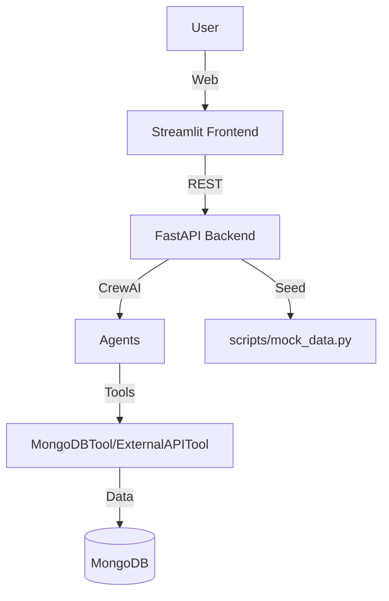

# Agentic AI

**Multi-Agent Business Assistant**  
Built with FastAPI, CrewAI, MongoDB, and Streamlit.

## Table of Contents

- [Overview](#overview)
- [Architecture](#architecture)
- [Agents & Tools](#agents--tools)
- [Setup & Installation](#setup--installation)
- [Usage](#usage)
- [API Endpoints](#api-endpoints)
- [Sample Prompts](#sample-prompts)
- [Technologies Used](#technologies-used)
- [License](#license)

---

## Overview

Agentic AI is a multi-agent business assistant platform that leverages LLM-powered agents to automate business analytics, customer support, and operational queries. It provides a web dashboard for business users to interact with specialized agents for support and analytics, powered by a FastAPI backend and a Streamlit frontend.

---

## Architecture



- **Frontend:** Streamlit app for user interaction.
- **Backend:** FastAPI app exposing `/query` endpoint for agentic processing.
- **Agents:** CrewAI-based agents for support and analytics.
- **Tools:** MongoDBTool for data, ExternalAPITool for order/client creation.
- **Database:** MongoDB for business data.

---

## Agents & Tools

### Agents

- **Support Agent**
  - Handles: Client data, order status, payments, course/class discovery, new orders/enquiries.
  - Tools: MongoDBTool, ExternalAPITool

- **Dashboard Agent**
  - Handles: Revenue analytics, client stats, attendance, enrollment trends.
  - Tools: MongoDBTool

### Tools

- **MongoDBTool**
  - Manages: Clients, orders, payments, courses, classes.
  - Example actions:
    - Find client: `{"action": "find_client", "query": {"email": "priya@example.com"}}`
    - Get upcoming classes: `{"action": "get_upcoming_classes"}`
    - Calculate revenue: `{"action": "calculate_revenue", "start_date": "YYYY-MM-DD", "end_date": "YYYY-MM-DD"}`

- **ExternalAPITool**
  - Manages: Creating clients, orders, and enquiries via external APIs.
  - Example actions:
    - Create client: `{"action": "create_client", "client_data": {...}}`
    - Create order: `{"action": "create_order", "order_data": {...}}`

---

## Setup & Installation

### Prerequisites

- Docker & Docker Compose
- Python 3.10+ (if running locally)
- MongoDB (runs as a container)

### 1. Clone the Repository

```bash
git clone https://github.com/Dhaval-pathak/qest-agentic-ai.git
cd agentic-ai
```

### 2. Environment Variables

Create a `.env` file in the root with:

```
MONGO_URI=mongodb://mongo:27017
DB_NAME=your_db_name
EXTERNAL_API_URL=https://api.example.com
EXTERNAL_API_KEY=your_key
OPENAI_API_KEY=your_key
API_URL=http://localhost:8000

```

### 3. Build & Run with Docker Compose

```bash
docker-compose up --build
```

- **Frontend:** [http://localhost:8501](http://localhost:8501)
- **Backend:** [http://localhost:8000](http://localhost:8000)
- **MongoDB:** [localhost:27017](localhost:27017)

### 4. (Optional) Seed Mock Data

The `seed` service in Docker Compose will automatically run `scripts/mock_data.py` to populate the database with sample data.

---

## Demo

### 🎯 Web Dashboard Overview

<p align="center">
  
</p>

---

### 🤖 Support Agent in Action

<p align="center">
  
</p>

---

### 📊 Dashboard Agent in Action

<p align="center">
  
</p>

## Usage

### Web Dashboard

- Open [http://localhost:8501](http://localhost:8501)
- Select an agent (Support or Dashboard)
- Enter your query or use a sample prompt
- View responses and query history

### API

- **POST** `/query`
  - **Body:**  
    ```json
    {
      "query": "How much revenue did we generate this month?",
      "agent_type": "dashboard"
    }
    ```
  - **Response:**  
    ```json
    {
      "agent_type": "dashboard",
      "response": "Total revenue: 10000"
    }
    ```

---

## API Endpoints

- `GET /` — Health check
- `POST /query` — Process a query via the selected agent

---

## Sample Prompts

**Support Agent:**
- What classes are available this week?
- Has order #12345 been paid?
- Create an order for Yoga Beginner for client Priya Sharma
- Show all pending payments for client john@example.com
- List all courses by instructor Anjali.

**Dashboard Agent:**
- How much revenue did we generate this month?
- Which course has the highest enrollment?
- What is the attendance percentage for Pilates?
- How many inactive clients do we have?
- Show enrollment trends for the last 6 months.

---


## Technologies Used

- **FastAPI** — Backend API
- **Streamlit** — Frontend dashboard
- **CrewAI** — Multi-agent orchestration
- **MongoDB** — Data storage
- **Docker** — Containerization
- **Python** — Core language
- **pymongo, requests, python-dotenv, streamlit-option-menu** — Supporting libraries

---

## License

MIT License  
Copyright (c) 2025 Dhaval Pathak


